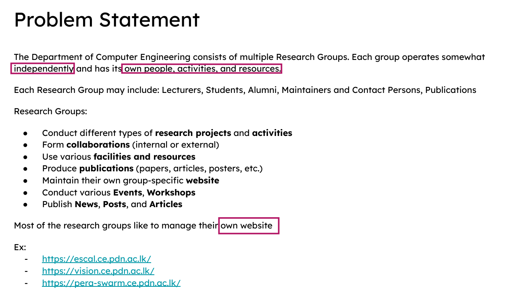
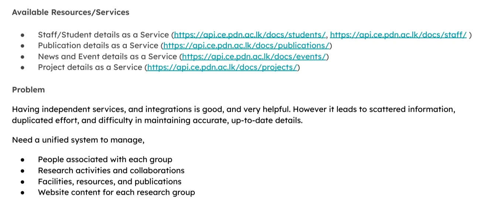

# 1-SOA

[https://github.com/NuwanJ/software-architecture-esb-demo](https://github.com/NuwanJ/software-architecture-esb-demo)

[https://www.youtube.com/watch?v=qj6pboedKDE](https://www.youtube.com/watch?v=qj6pboedKDE)





When each site directly access each resource/service to manage their content it will be scattered/messy.


`SOA (Service Oriented Architecture)` provides a solution for that.

The `ESB (Enterprise Service Bus)` simplifies the mess by centralizing the service access.

This is called integration development.


The websites consume the API services through the ESB.

The ESB will do all the mapping, transformations and filtering and provide specific data as responses.

There are different ways of implementing this.

In this lab, we will be implementing like below


The APIs on the left will provide the generic data.

The APIs on the right are the `managed APIs` by the ESB and the different research groups can consume them instead of directly interacting with the service APIs and manually doing mapping, filtering and transformation.

They will get only the relevant data for their research group.

# Demonstration


Docs - https://mi.docs.wso2.com/en/latest/develop/mi-for-vscode/mi-for-vscode-overview/

WSO2 Integrator: MI offers an extension for Visual Studio Code (VS Code) that simplifies the development of integration solutions.

**MI stands for Micro Integrator**, which is a lightweight, cloud-native, low-code integration platform that helps businesses connect applications, data, and services

# Steps

Install the plugin in VS code

Create a new project

We will be using APIs documented in [https://api.ce.pdn.ac.lk/](https://api.ce.pdn.ac.lk/)


We will be implementing the integration for publications


API documentation for publications - [https://api.ce.pdn.ac.lk/docs/publications/](https://api.ce.pdn.ac.lk/docs/publications/)

We will be using [https://api.ce.pdn.ac.lk/publications/v1/filter/research-groups/](https://api.ce.pdn.ac.lk/publications/v1/filter/research-groups/) **API endpoint**


Create an HTTP endpoint


Create another endpoint


Each endpoint will get an XML file with its info


Create an API


`/research-groups/v1/{slug}/`

We will be doing it for computer vision website


Right now, these publications are hardcoded in the website.

We are going to create an API service and make it available for the website to use it to fetch latest info instead of hardcoding


Add a resource (publications)


Now, we can define what should happen when the API is called

What we want is to send the part of the response related to vision


SO the ESB should call the service API and filter only the vision related publications.

Click on the + sign


Now we need to `map` the data → click on the + icon on the arrow


Copy paste the payload of - [https://api.ce.pdn.ac.lk/publications/v1/filter/research-groups/](https://api.ce.pdn.ac.lk/publications/v1/filter/research-groups/)

The app will automatically identify the schema

Define the output schema as well


Now map the input and output


To get the count value calculated, add a `Sub Mapping`


Now, return the output as a response


We can also add a `Log` component

Then, do the same for the `/publications` API as well.


add `call endpoint`


Add `data mapping`


Input

```python
{
  "status": "success",
  "data": {
    "code": "computer-vision",
    "name": "Computer Vision",
    "metadata": {
      "description": "We are a research group consisting of faculty, students and external collaborators trying to push the boundaries of computer vision theory and applications.",
      "primary_contact_person": "roshanr@eng.pdn.ac.lk",
      "maintainer": "roshanr@eng.pdn.ac.lk",
      "page": "https://portal.ce.pdn.ac.lk/download/taxonomy-page/computer-vision",
      "website": "https://vision.ce.pdn.ac.lk/"
    },
    "taxonomy": "research-groups"
  }
}
```

Output (metadata is not an object - the fields are flattened

```python
{
  "status": "success",
  "data": {
    "code": "computer-vision",
    "name": "Computer Vision",
    "description": "We are a research group consisting of faculty, students and external collaborators trying to push the boundaries of computer vision theory and applications.",
    "primary_contact_person": "roshanr@eng.pdn.ac.lk",
    "maintainer": "roshanr@eng.pdn.ac.lk",
    "page": "https://portal.ce.pdn.ac.lk/download/taxonomy-page/computer-vision",
    "website": "https://vision.ce.pdn.ac.lk/",
    "taxonomy": "research-groups"
  }
}
```


Let the AI do the mapping → My AI did not work though :(


Add the response


Run the application


Test the endpoint


